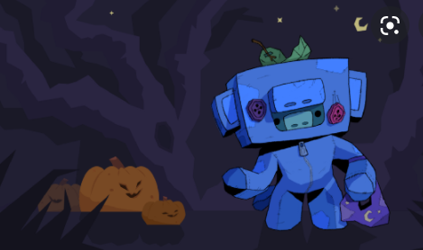
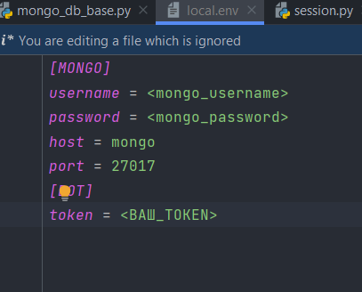

# [WumpusBot](https://t.me/catch_wumpust_bot) | Python 3.9.0

Телеграм бот WumpusBot - игра основанная на известной «Hunt the Wumpus»

>«Hunt the Wumpus» — это пещера из 20 
пронумерованных комнат, каждая из которых соединена тоннелями с тремя другими, т. е. пещера представляет собой 
расплющенный додекаэдр (в последующих версиях используются топологии, основанные на икосаэдре, листе Мёбиуса, 
пчелиных сотах и др.)2. В начале игры персонаж случайным образом оказывается в одной из комнат пещеры. За ход он 
может либо выстрелить в одну из трёх соседних комнат, либо перейти в какую-нибудь из них.

# Установка
Для работы проекта нам предварительно потребуются
- Python - 3.9.0
- Предварительно установленный Docker и Docker-compose
- Git

### Создаем проект
- создаем папку в которой будем работать `mkdir wumpus`
- `cd wumpus`
- `git clone https://github.com/VasiliySilver/Wumpus.git`
- `cd Wumpus`

### Виртуальное окружение
- `python -m pip install virtualenv`
- `virtualev venv`

Активация
  
>- for Linux - `source venv\bin\activate`
>- for Windows - `venv\Scripts\activate.bat`

Деактивация

> `deactivate`

### Консольная игра

---

1. переходим в корневую директорию `Wumpus`
2. Выполняем команду `pip install -r requirements.txt`
3. Перейти в папку `console`
4. выполнить python main.py

### Игра в Telegram

---

#### Установка через Docker

1. Добавить файл .env в папку bot

2. Заходим в телеграмм ищем BotFather
3. Создаем бота и получаем Token
4. Устанавливаем нужный нам токен
5. В корневой дирректории выполняем `docker-compose up`
6. Заходим в бота и наслаждаемся игрой

#### Обычная установка

1. Добавить файл .env в папку bot

2. Заходим в телеграмм ищем BotFather
3. Создаем бота и получаем Token
4. Устанавливаем нужный нам токен
5. переходим в корневую директорию `Wumpus`
6. Выполняем команду `pip install -r requirements.txt`
7. Выполняем `python chat.py`
8. Заходим в бота и наслаждаемся игро1

